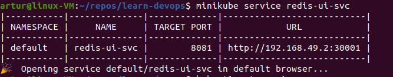

# Short k8s Notes

### Use minikube with Docker driver

```bash
$ minikube start --driver=docker
```

- or to make it the default driver

```bash
$ minikube config set driver docker
```

- to run with logs:
```bash
$ minikube start ... --alsologtostderr -v=<level>
```

### Installation stuff

if to install `docker` with `snap` then `minikube start` won't run properly. Should be installed manually with `apt` or with the installation `.sh` file


### Bash complete
```bash
$ kubectl complete bash > /etc/bash_completion.d/kubectl
$ exec bash  # to apply changes in the current shell
```


### Commands

* Create a deployment:
```bash
$ kubectl create deployment first-dep-ever --image=busybox --port=5071 --replicas=2
```
or
```bash
$ kubectl create deployment nginx-dep --image=nginx --port=80
```

_podId_ is created from its deplyoment name, id of the replicaset and its own id


#### **CrashLoopBackOff**

when starting a deployment (which also means running pods), something like this may appear:


The state itself means that a pod keeps starting, crashing and starting all the time. At least according to the default `Always` of `restartPolicy` (the other options are `OnFailure` and `Never`), which can be specified in `PodSpec`:
```yaml
apiVersion: v1
kind: pod
metadata:
  name: some-pod
spec:
  containers:
    - name: some-pod
      image: ubuntu
  restartPolicy: Always
```
this can be edited (among the other ways) by running `kubectl edit`
```bash
$ kubectl edit pod <pod-id>
```
> or the same change can be made for a whole deployment

but in this specific case the issue happened because the image which was used for the deployment `first-dep-ever` does not have any command and just starts, immediately finishes its work and restarts again.

#### Debugging
```bash
$ kubectl describe <pod-name>
```

```bash
$ kubectl logs <pod-name>
```

```bash
$ kubectl exec -it <pod-name> -- <shell>
```

---

#### minikube-specific
When creating an external service:
```yaml
spec:
  # some other sections
  type: LoadBalancer
  ports:
    - protocol: TCP
      port: 8081
      targetPort: 8081
      nodePort: 30001
```

in `minikube` there will be **no** external IP:


to access the service:
```bash
$ minikube service <service-name>
```


---

```bash
$ kubectl api-resources
```
the way to get possible resource kinds and the shortnames


### Ingress

* To enable an Ingress Controller in minikube:
```bash
$ minikube addons enable ingress
```

* no need to use External Services for it;
* an example:

```yaml
apiVersion: networking.k8s.io/v1
kind: Ingress
metadata:
  name: ingress-demo
  namespace: kubernetes-dashboard
spec:
  rules:
    - host: ingress-demo-dashboard.com
      http:
        paths:
        - pathType: Prefix
          path: "/"
          backend:
            service:
              name: kubernetes-dashboard
              port:
                number: 80
```
> minikube already has configured and working services, therefore it is more convenient to define an ingress for it

* also DNS resolving should be set up:
```bash
# get the IP of the ingress
$ kubectl get ingress -n kubernetes-dashboard
NAME           CLASS    HOSTS                        ADDRESS        PORTS   AGE
ingress-demo   <none>   ingress-demo-dashboard.com   192.168.49.2   80      51s


$ vim /etc/hosts

-------
# put the IP and the name specified in HOSTS

```